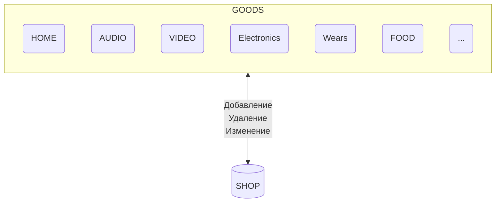

Класс SHOP это магазин - не важно чего, будет состоять из товаров

Каждая категория товаров GOODS тоже отдельные классы

Следовательно SHOP будет состоять из многих отдельных классов:
* Array!?
* ArrayList?!
* Map?! HashMap?!
* др.!?



GOODS категоории товаров, они могут меняться. т.е. добавляться или удаляться, следовательно нужен динамически изменямый тип данных и быстрая вставка/удаление и быстрый доступ для изменения:
* ArrayList?!
* Map?! HashMap?!
* Set?!
* др.!?

Сам класс GOOD будет содержать в себе коллекцию категорий товара:
* класс Notebook
* класс TV
* класс FOOD
* и т.д.

А наименование можно использовать как "ключ" для доступа к определенной категории товара --> можно использовать MAP
```java
class Shop{
    Map<String,ArrayList<Object>> goods;
}
```

